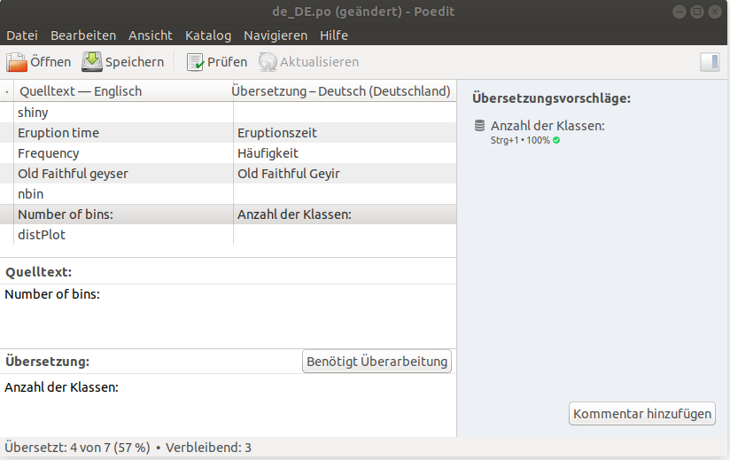

```{r setup, include=FALSE}
library("gettext")
knitr::opts_chunk$set(echo = TRUE)
```

With GNU gettext programmers got a utility to internationalise their applications:

*Usually, programs are written and documented in English, and use English at execution time for interacting with users. This is true not only from within GNU, but also in a great deal of proprietary and free software. Using a common language is quite handy for communication between developers, maintainers and users from all countries. On the other hand, most people are less comfortable with English than with their own native language, and would rather be using their mother tongue for day to day's work, as far as possible. Many would simply love seeing their computer screen showing a lot less of English, and far more of their own language.*

The package implements `gettext`, `ngettext` to use various languages and domains in parallel. `xgettext` extracts all strings from a R file or a R expression.

# Understanding GNU gettext

## GNU gettext vocabulary

**Domain**
: GNU gettext distinguishes between domains. Basically a domain is the name for your application. This allows to create different translations for the same messages in dependence of the application in use.

**Language**
: GNU gettext distinguishes between languages ;) It allows to translate messages for application in every language.

**Plural**
: In your application you may have messages which depend on numbers, e.g. `1 error made`, `2 errors made`, ... . In some languages you have more than one plural form, e.g. in arabic you have up to six plural forms depending on your number.

**Context**
: The translation of a messages may depend on a context, e.g. the translation of `I saw her duck` depends on the interpretation of `duck`, it differs if `duck` is a noun or a verb.

Usually in a PO file the messages and its translation for one language and one domain is stored. Plurals and contexts are coded in the PO file.

## PO file structure

For detailed overview, see the GNU gettext manual, section [The Format of PO files](https://www.gnu.org/software/gettext/manual/html_node/PO-Files.html#PO-Files).

The basic structure is an entry of the form

```{r eval=FALSE}
msgid untranslated-string
msgstr translated-string
```

Plurals can be added by 

```{r eval=FALSE}
msgid untranslated-string-singular
msgid_plural untranslated-string-plural
msgstr[0] translated-string-case-0
...
msgstr[N] translated-string-case-n
```

To use plurals you need to define in your PO file how from the number in the message
the correct plural form from 0 till N can be calculated.

Contexts can be given by

```{r eval=FALSE}
msgctxt context
msgid untranslated-string
msgstr translated-string
```

## ISO 639

ISO 639 is a set of standards by the International Organization for Standardization that is concerned with representation of names for languages and language groups. It uses a two- or three letter code to identify a language.

```{r}
library("gettext")
data(iso639)
head(iso639)
```

# An example with Shiny

The package contains two example apps which shows an interactive histogram using Shiny, see [`shiny/app1/app.R`](#app1) and [`shiny/app2/app.R`](#app2).

The first step would be to extract all texts from your program (here we take the example `app.R` which
is included in the package)

```{r}
xgettext(system.file('shiny', 'app1', 'app.R', package='gettext'))
```

Note: A difference to the standard `xgettext` is that ALL strings are extracted from the R program. 
The output consists of four columns: the first columns tells if it is a single string, or within a 
\code{gettext}, \code{G}, \code{ngettext} or \code{N} command. The second column is the message id 
and the third column contains the plural form. The fourth column contains the context (default: \code{NA}).
Therefore you can check later if all strings which needs to be translated are really translated, see [in the appendix](#xget2).

The next step is to create a template file for the translation, a `pot` file, from it:

```{r}
txt <- xgettext(system.file('shiny', 'app1', 'app.R', package='gettext'))
writePotfile(txt, 'myproject.pot')
```

You may edit the [POT file](#pot), e.g. with an editor as [Poedit](https://poedit.net/), 
and create a [PO file](#po) for german and store it in your Shiny app directory.



The final step is to modify your [app](#app2), replace any `"text"` by `gettext("text")`. The observer in the app in at the beginning uses the URL parameter `lang` to choose the language.

To see a demo of the apps you may run

```{r eval=FALSE}
exampleApp('app1')   # Shiny app without language support 
exampleApp('app2en') # Shiny app in the default language (english)
exampleApp('app2de') # Shiny app in german
```

# The `gettext` package

## `getTranslation`, `saveTranslation`, and `readTranslation`

The package has an internal environment `translation` which stores the messages and its translations. 
With `getTranslation()` you can get a copy of this environment as a list. Note that changes in this copy
will not change anything in the internal environment.

The internal environment can be saved to and read from a file with the commands `saveTranslation` and `readTranslation`. These commands use internally `saveRDS` and `readRDS`. Rather than analysing a `PO`file when starting your program, as in the example appy, you might load all messages and save it. In your app you may load the saved translations via `readtranslation`.

##`options`, `bind` and `bindtextdomain`

In `gettext` you need to specify a *language* and a *domain*. The domain becomes important when you load translations for several apps, because the same text might be translated differently in two apps. Since most 
users wil have just one app they will simplay use the default domain `''`. The current language and domain can be set by 

```{r, eval=FALSE}
options(gettext.lang='lang')
options(gettext.domain='mydomain')
```

The `bind` command decomposes a base file name into language and domain. For detecting the language at the end
of a file name the `iso639` data object ist used.

```{r}
bind('myproject_de.po')
bind(de='myproject.po')
bind(de=c('myproject1.po', 'myproject2.po'))
bind(de=c('myproject1_de.po', 'myproject2_de.po'), 
          en=c('myproject1_en.po', 'myproject2_en.po'))
files <- c("myproject_de.po", 
            "intl/for_use_owncloud_impress_cs_CZ.po",
           "intl/ibalsa-master-zh_HK.po",
           "spirit-po/test1.po")
bind(files)
```

The `bindtextdomain` looks at all `.po` files from the directory, calls `bind` and replaces the detected domains
by the given domain.

## `readPofile`

Reads one or more `PO` files into the internal translation environment. If file names are given then the default
domain and languages will be used. You may change that by using the parameters `lang` and `domain`. 

```{r, eval=FALSE}
readPofile('myproject_de_DE.po', lang='de')
```

## `gettext`, `ngettext` and `dsub`

With `gettext` and `ngettext` you can get translations for your text. Since R does not support `_` as operator
and it might not be a good idea to define a function `_` I use `G` and `N` as abbreviations.

```{r, eval=FALSE}
gettext('No translation found')
ngettext('Found %.0f translation', 'Found %.0f translations', 7)
```

Both commands use either the currently set language and domain 

```{r, eval=FALSE}
getOption('gettext.lang')
getOption('gettext.domain')
```

or you can explicitly use the parameters `lang` and `domain`.

`dsub` and `S` perform the dollar substitution

```{r}
dsub('$a EUR', a=3)
dsub('$aEUR', a=3, aE=7)
S('$a EUR', list(a=3))
```

## `xgettext` and `writePotfile`

`xgettext` analyzes an expression for text constants and `gettext`, `ngettext`, `G` and `N` function calls.

```{r}
file <- system.file('shiny', 'app1', 'app.R', package='gettext')
xgettext(file)
file <- system.file('shiny', 'app2', 'app.R', package='gettext')
xgettext(file)
```

The result of `xgettext` can be stored in a `POT` file to create with external software translations 
in other languages.

```{r, eval=FALSE}
file <- system.file('shiny', 'app2', 'app.R', package='gettext')
txt  <- xgettext(file)
writePotfile(txt, "my.pot")
```

## `addMsg` and `addPlural`

`readPofile` uses `addMsg` to add a message and its translations to the internal environment. 
With `addPlural` you can add a plural for a language and domain. Basically you could circumvent 
the usage of `POT` and `PO` files by using them directly. 

For example plurals see `plural`

```{r}
data(plural)
plural[[7]]  # Arabic
``` 

## `exampleApp`

With `exampleApp` you can list all Shiny examples and run a specific example.

```{r}
exampleApp() 
```

To run a specific example call

```{r, eval=FALSE}
exampleApp('app1') 
```

# Appendix

## `shiny/app1/app.R` {#app1}

```{r, code=readLines(system.file('shiny', 'app1', 'app.R', package='gettext')), eval=FALSE}
```

## `shiny/app2/app.R` {#app2}

```{r, code=readLines(system.file('shiny', 'app2', 'app.R', package='gettext')), eval=FALSE}
```

## `shiny/app2/myproject.pot` {#pot}

```{r, code=readLines(system.file('shiny', 'app2', 'myproject.pot', package='gettext')), eval=FALSE}
```

## `shiny/app2/myproject_de_DE.po` {#po}

```{r, code=readLines(system.file('shiny', 'app2', 'myproject_de_DE.po', package='gettext')), eval=FALSE}
```

## `xgettext` on `shiny/app2/app.R` {#xget2}

```{r}
xgettext(system.file('shiny', 'app2', 'app.R', package='gettext'))
```

The `NA` entries indicate that a `gettext` has been been found in the R code. Below you see the extracted
text constant. It there is no text constant to extract then the following entry may not appear, 
but at least you are hinted to this `gettext` in your program.

## `xgettext` on `shiny/app3/app.R` {#xget3}

```{r}
xgettext(system.file('shiny', 'app3', 'app.R', package='gettext'))
```